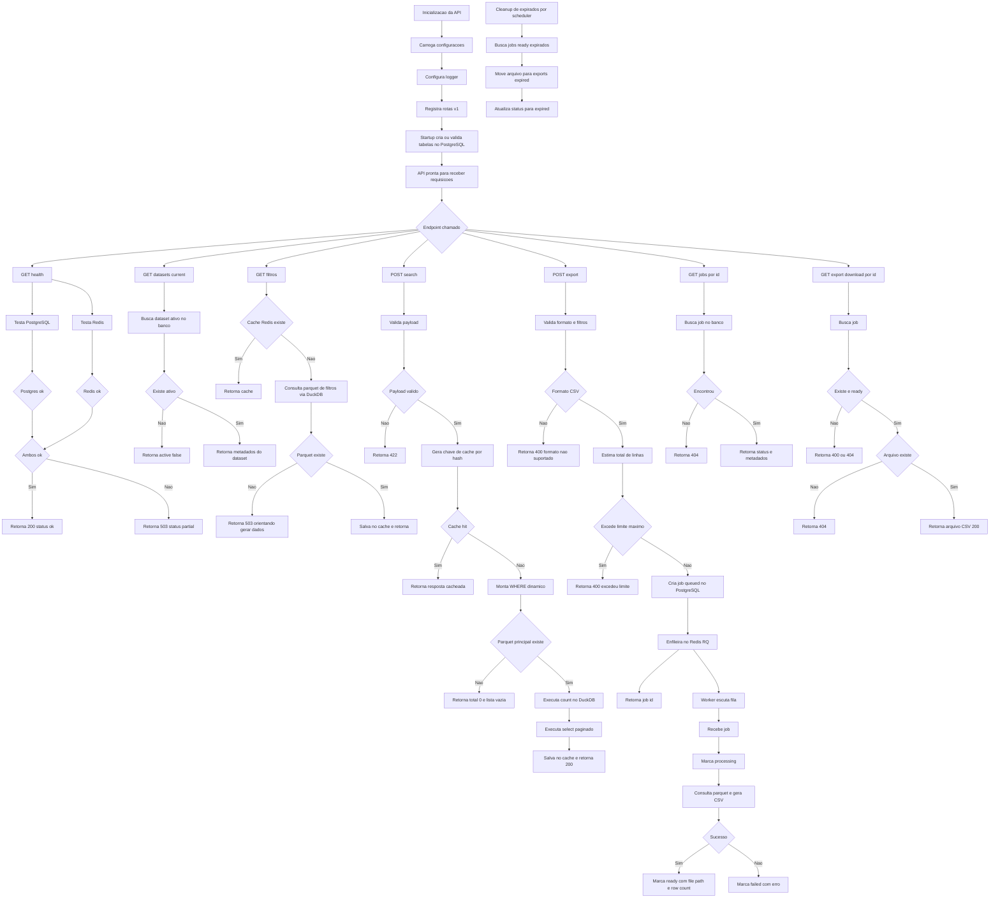

# Fluxograma do Fluxo do Sistema

```mermaid
flowchart TD
    A[Inicializacao da API] --> A1[Carrega configuracoes]
    A1 --> A2[Configura logger]
    A2 --> A3[Registra rotas v1]
    A3 --> A4[Startup cria ou valida tabelas no PostgreSQL]
    A4 --> A5[API pronta para receber requisicoes]

    A5 --> R{Endpoint chamado}

    R --> H[GET health]
    H --> H1[Testa PostgreSQL]
    H --> H2[Testa Redis]
    H1 --> H3{Postgres ok}
    H2 --> H4{Redis ok}
    H3 --> H5{Ambos ok}
    H4 --> H5
    H5 -->|Sim| H6[Retorna 200 status ok]
    H5 -->|Nao| H7[Retorna 503 status partial]

    R --> D[GET datasets current]
    D --> D1[Busca dataset ativo no banco]
    D1 --> D2{Existe ativo}
    D2 -->|Nao| D3[Retorna active false]
    D2 -->|Sim| D4[Retorna metadados do dataset]

    R --> F[GET filtros]
    F --> F1{Cache Redis existe}
    F1 -->|Sim| F2[Retorna cache]
    F1 -->|Nao| F3[Consulta parquet de filtros via DuckDB]
    F3 --> F4{Parquet existe}
    F4 -->|Nao| F5[Retorna 503 orientando gerar dados]
    F4 -->|Sim| F6[Salva no cache e retorna]

    R --> S[POST search]
    S --> S1[Valida payload]
    S1 --> S2{Payload valido}
    S2 -->|Nao| S3[Retorna 422]
    S2 -->|Sim| S4[Gera chave de cache por hash]
    S4 --> S5{Cache hit}
    S5 -->|Sim| S6[Retorna resposta cacheada]
    S5 -->|Nao| S7[Monta WHERE dinamico]
    S7 --> S8{Parquet principal existe}
    S8 -->|Nao| S9[Retorna total 0 e lista vazia]
    S8 -->|Sim| S10[Executa count no DuckDB]
    S10 --> S11[Executa select paginado]
    S11 --> S12[Salva no cache e retorna 200]

    R --> E[POST export]
    E --> E1[Valida formato e filtros]
    E1 --> E2{Formato CSV}
    E2 -->|Nao| E3[Retorna 400 formato nao suportado]
    E2 -->|Sim| E4[Estima total de linhas]
    E4 --> E5{Excede limite maximo}
    E5 -->|Sim| E6[Retorna 400 excedeu limite]
    E5 -->|Nao| E7[Cria job queued no PostgreSQL]
    E7 --> E8[Enfileira no Redis RQ]
    E8 --> E9[Retorna job id]

    E8 --> W0[Worker escuta fila]
    W0 --> W1[Recebe job]
    W1 --> W2[Marca processing]
    W2 --> W3[Consulta parquet e gera CSV]
    W3 --> W4{Sucesso}
    W4 -->|Sim| W5[Marca ready com file path e row count]
    W4 -->|Nao| W6[Marca failed com erro]

    R --> J[GET jobs por id]
    J --> J1[Busca job no banco]
    J1 --> J2{Encontrou}
    J2 -->|Nao| J3[Retorna 404]
    J2 -->|Sim| J4[Retorna status e metadados]

    R --> DL[GET export download por id]
    DL --> DL1[Busca job]
    DL1 --> DL2{Existe e ready}
    DL2 -->|Nao| DL3[Retorna 400 ou 404]
    DL2 -->|Sim| DL4{Arquivo existe}
    DL4 -->|Nao| DL5[Retorna 404]
    DL4 -->|Sim| DL6[Retorna arquivo CSV 200]

    C0[Cleanup de expirados por scheduler] --> C1[Busca jobs ready expirados]
    C1 --> C2[Move arquivo para exports expired]
    C2 --> C3[Atualiza status para expired]
```